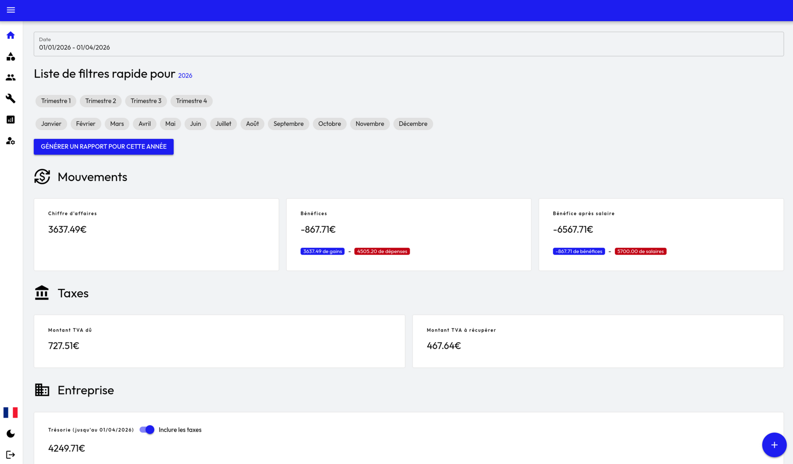
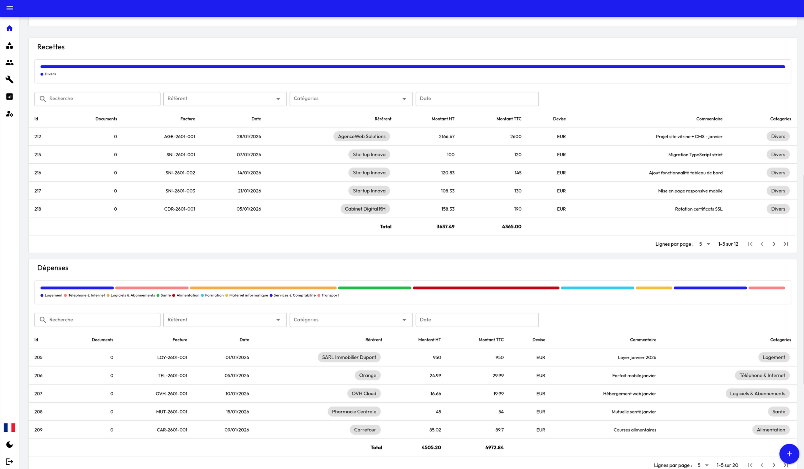

# Accounting

Un simple outil pour gérer la comptabilité et tenir un cahier des comptes en tant qu’auto-entrepreneur en
micro-entreprise.





## TODO:

- Finir les issues
- Finir la page profile
- Ajouter une section salaires dans les rapports
- Ajouter l'inclusion/exclusion des taxes dans les rapports

## Fonctionnalités

- Ajouter des entrées de revenus et de dépenses
- Catégoriser les transactions
- Générer des rapports financiers
- Ajouter des "référents" pour les transactions (ex : clients, fournisseurs)
- Visuel rapide sur les finances (trésorerie, bénéfices, chiffre d'affaires, etc.)
- Gestion de la TVA (si applicable)
- Charts et graphiques pour visualiser les données financières

## Technologies utilisées

- Vue JS & Inertia JS pour le frontend
- Adonis JS pour le backend (MVC)
- MariaDB pour la base de données
- Quasar JS pour les composants UI

## Particularité

La trésorerie totale par rapport à la date sélectionnée est recalculée à chaque requête. On récupère toutes les
transactions depuis le début et on les ajoute à la trésorerie de base de l'utilisateur.

Une meilleure méthode serait de stocker la trésorerie à chaque transaction, mais cela rendrait les choses plus
compliquées à gérer et à maintenir. De plus, pour un auto-entrepreneur, le nombre de transactions n'est généralement pas
très élevé, donc cette méthode est suffisante pour les besoins de l'application.

### Possibilités d'amélioration:

- Ajouter un système de cache pour les transactions afin d'améliorer les performances

- Implémenter une méthode de calcul de la trésorerie plus efficace, comme:
  - le stockage de la trésorerie à chaque transaction, tout en gérant les mises à jour et les corrections de
    transactions de manière efficace
  - ou stocker la trésorerie dans une autre table avec un champ unique pour chaque date, et mettre à jour cette table à
    chaque transaction. Ou mieux encore, garder un champ trésorerie par mois

## Installation

### Docker

1 - Pull de l'image Docker

```bash
docker pull ghcr.io/juliendu11/accounting:latest
```

2 - Copier le fichier `.env.example` en `.env` et configurer les variables d'environnement. Ne pas oublier de mettre
NODE_ENV en production.
3 - Lancer le conteneur Docker

```bash
docker run --env-file .env -p 3333:3333 --name accounting-app ghcr.io/juliendu11/accounting:latest
```
